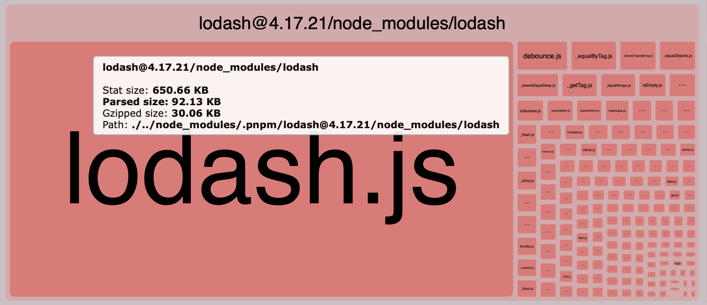
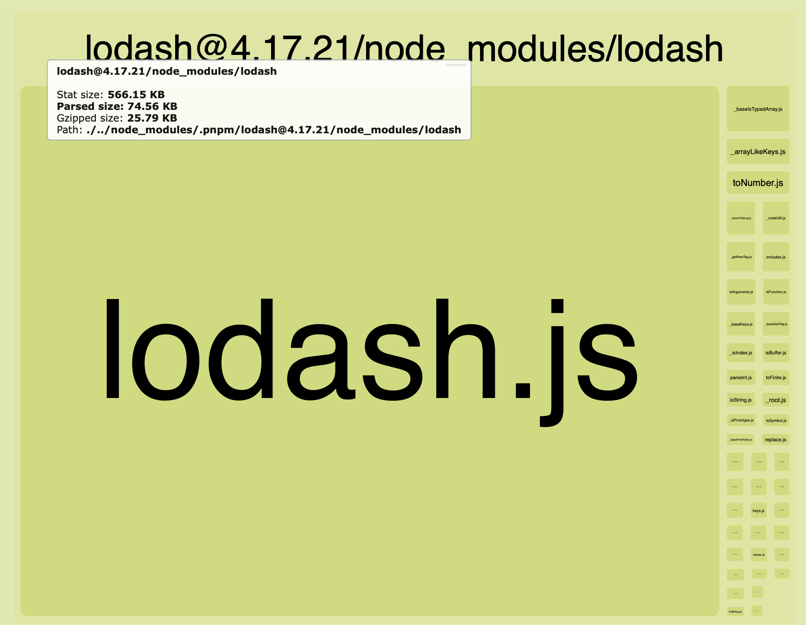

인터넷에 검색해보면 Lodash를 사용할 때 개별 모듈을 가져오도록 해야 번들 사이즈를 줄일 수 있다 는 글을 볼 수 있다. 하지만 실제 결과는 프로젝트 규모, 번들러의 구성에 따라 달라질 수 있음을 깨달아 기록해본다.

lodash를 사용하는데, 제공하는 모든 모듈을 사용하는 것이 아니기 때문에 개별적으로 사용하는 모듈만 가져오는 것이 번들 사이즈를 줄여줄 것이라고 생각했다.

```javascript
import _ from ‘lodash’; // 전체 import
import map from ‘lodash/map’; // 개별 import
```

나는 확신에 차 있었기에 lint 규칙에까지 전체 import 방식을 사용하지 못하도록 설정해놓고 프로젝트에서 모든 부분을 개별 import로 약 180여개 파일을 수정했다.

그리고 나서 팀 내에 공유하면서 근거로 삼기 위해 bundle-analyzer를 사용해 번들 사이즈를 확인해본 결과

<figure>

<figcaption>개별 import 시 번들 사이즈</figcaption>

<figcaption>전체 import 시 번들 사이즈</figcaption>
</figure>

전체 import:
Parsed size: 74.56KB
개별 import:
Parsed size: 92.13KB

예상과 다르게 개별 import 방식이 전체 import 방식보다 오히려 번들 사이즈를 증가시키는 결과가 나왔다.

공식 문서에 Per Method Packages 라는 글이 있었다. (https://lodash.com/per-method-packages)
요약하면 다음과 같다.
->
함수별 독립적으로 사용할 수 있으나, 권장되지 않는다. 더 가벼워 보일 수 있지만 함수들 간에 공유하는 베이스 코드가 있는데 독립적으로 사용하면 의존해야 하는 코드들을 내부적으로 중복 번들한다.

1. 중복코드
   lodash 내부적으로 함수들이 공유하는 코드가 있고, 각 함수들이 내부 함수를 공유하여 사용하는 경우 가 있다.

- 전체 import
  - 모든 함수가 하나의 모듈로 가져와지므로 공유하는 내부 코드가 중복 없이 번들에 포함된다. 트리쉐이킹을 통해 사용하지 않는 코드를 제거할 수 있다.
- 개별 import
  - 각 모듈이 필요로하는 내부 코드가 독립적으로 번들에 포함된다. 예를 들어 lodash/map과 lodash/filter 같은 모듈을 가져올 때 이들이 서로 다른 독립 모듈로 처리되면서 동일한 공유 내부 코드가 여러 번 번들에 포함되는 것이다.

2. 트리쉐이킹
   모듈 내부에서 사용되지 않는 코드를 제거한다. 하지만 개별 모듈이 독립적으로 처리되면 불필요 코드는 제거되겠지만 공통적으로 사용하는 코드가 중복 포함되는 것은 방지 못할 수 있다.

특히, lodash는 CommonJS 모듈로 작성되어있어서 ES 모듈과 달리 트리 쉐이킹이 덜 최적화되어있다.

결론은
lodash 전체 모듈 import는 다양한 lodash 함수를 사용할 떄 더 효율적일 수 있다는 것이다.
개별 모듈 import는 적거나 단일 함수만 사용되는 작은 프로젝트에서 효과적일 수 있다.

lodash-es와 같은 ES 모듈 버전을 사용하면 필요한 코드만 번들에 포함시킬 수 있다.
npm install lodash-es
import { map } from 'lodash-es';
babel-plugin-lodash를 사용해서 전체 모듈을 가져오더라도 트리 쉐이킹이 잘 작동하도록 도와서 번들 크기를 줄일 수 있다.
npm install --save-dev babel-plugin-lodash
{
"plugins": ["lodash"]
}(.babelrc or next.config.js)

불필요한 lodash 사용을 피한다 (ES6+에서 제공하는 기본 내장 함수로 대체)

**This article is for Demo purpose**

The article was originally on [this repo](https://github.com/risan/risanb.com/blob/master/content/posts/react-component-with-dot-notation/index.md)

This is my answer to someone's question on [StackOverflow](https://stackoverflow.com/questions/49256472/react-how-to-extend-a-component-that-has-child-components-and-keep-them/49258038#answer-49258038). How can we define a React component that is accessible through the dot notation?

Take a look at the following code. We have the `Menu` component and its three children `Menu.Item`:

```jsx
const App = () => (
  <Menu>
    <Menu.Item>Home</Menu.Item>
    <Menu.Item>Blog</Menu.Item>
    <Menu.Item>About</Menu.Item>
  </Menu>
);
```

How can we define a component like `Menu`? Where it has some kind of "sub-component" that is accessible through a dot notation.

Well, it's actually a pretty common pattern. And it's not really a sub-component, it's just another component being attached to another one.

Let's use the above `Menu` component for example. We'll put this component to its own dedicated file: `menu.js`. First, let's define these two components separately on this module file:

```jsx
// menu.js
import React from 'react';

export const MenuItem = ({ children }) => <li>{children}</li>;

export default const Menu = ({ children }) => <ul>{children}</ul>;
```

It's just a simple functional component. The `Menu` is the parent with `ul` tag. And the `MenuItem` will act as its children. Now we can use these two components like so:

```jsx
import React from "react";
import { render } from "react-dom";
import Menu, { MenuItem } from "./menu";

const App = () => (
  <Menu>
    <MenuItem>Home</MenuItem>
    <MenuItem>Blog</MenuItem>
    <MenuItem>About</MenuItem>
  </Menu>
);

render(<App />, document.getElementById("root"));
```

Where's the dot notation? To make our `MenuItem` component accessible through the dot nation, we can simply attach it to the `Menu` component as a static property. To do so, we can no longer use the functional component for `Menu` and switch to the class component instead:

```jsx
// menu.js
import React, { Component } from 'react';

export default const MenuItem = ({ children }) => <li>{children}</li>;

export default class Menu extends Component {
  static Item = MenuItem;

  render() {
    return (
      <ul>{this.props.children}</ul>
    );
  }
}
```

Now we can use the dot notation to declare the `MenuItem` component:

```jsx
import React from "react";
import { render } from "react-dom";
import Menu from "./menu";

const App = () => (
  <Menu>
    <Menu.Item>Home</Menu.Item>
    <Menu.Item>Blog</Menu.Item>
    <Menu.Item>About</Menu.Item>
  </Menu>
);

render(<App />, document.getElementById("root"));
```

You can also put the `MenuItem` component definition directly within the `Menu` class. But this way you can no longer import `MenuItem` individually.

```jsx
import React, { Component } from "react";

export default class Menu extends Component {
  static Item = ({ children }) => <li>{children}</li>;

  render() {
    return <ul>{this.props.children}</ul>;
  }
}
```

**This article is for Demo purpose**

The article was originally on [this repo](https://github.com/risan/risanb.com/blob/master/content/posts/react-component-with-dot-notation/index.md)
